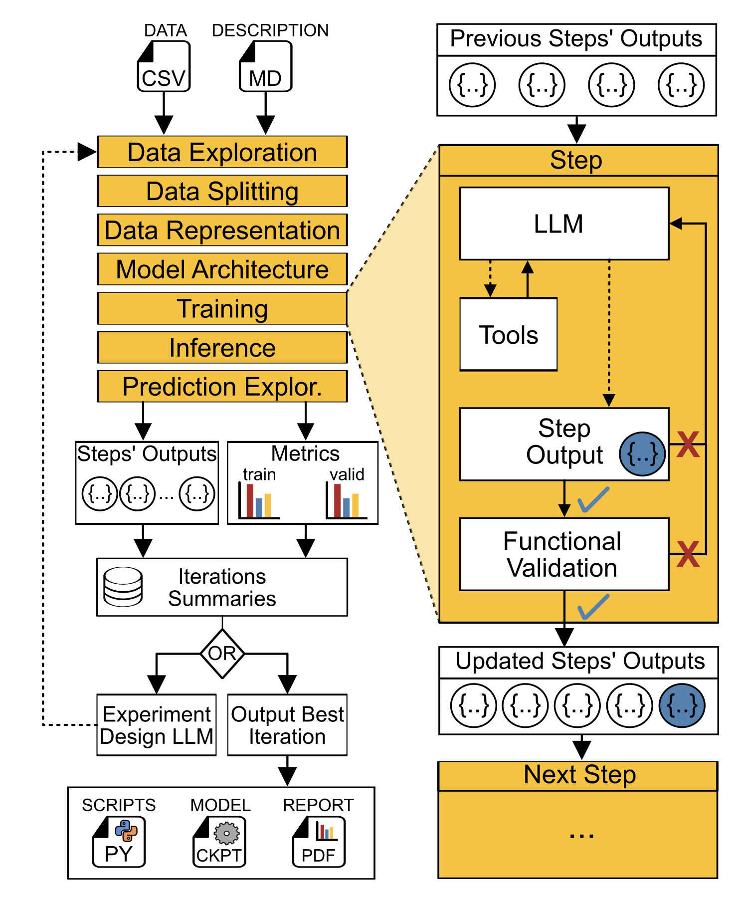

# Agentomics-ML
*Agentomics is currently under peer review.*

**Reproducing publication results:** See the [ismb_submission branch](https://github.com/BioGeMT/Agentomics-ML/tree/ismb_submission) README for instructions.

## Autonomous agentic system for supervised machine learning model development.

Made for biomedical data, Agentomics outperformed human experts and created new state-of-the-art models for problems in Protein Engineering, Drug Discovery, and Regulatory Genomics.


How it works
1) Input is a CSV training dataset + optional data description
2) Agentomics autonomously experments with various ML models and strategies
3) Output is a trained model ready for inference and a detailed PDF report summarizing the development process and achieved metrics

<p align="center">
  
</p>

## Try the DEMO
[](https://colab.research.google.com/drive/1rxsGsIwxrE49E4rjzNh920s66UdG34xF?usp=sharing)
## Quick Start

```bash
git clone https://github.com/BioGeMT/Agentomics-ML.git
cd Agentomics-ML
cp .env.example .env
# Edit .env and set at least one API key (OPENROUTER_API_KEY or OPENAI_API_KEY)

# Download example datasets
./download_example_datasets.sh

./run.sh --pull-images
```

Recommended model: `gpt-5.1-codex-max`

Outputs are saved to `outputs/<agent_id>/`, including PDF reports in `outputs/<agent_id>/pdf_reports`.

## Documentation

For more details visit **https://biogemt.github.io/agentomics-ml/**

## Key Features
- Generic: Agentomics can crunch any classification and regression datasets in CSV format.
- Secure: Agents execute code securely in Docker with read-only mounts to your file system and are only allowed to write in a Docker Volume.
- Reproducible: Outputs include models, scripts, and conda environments needed to run inference or re-train models with one bash command.
- Trustworthy: If you provide a test set, Agentomics fully abstracts LLMs from accessing it, allowing you to rely on programmaticly computed and reported test set metrics.
- Foundation models: Agentomics can leverage foundation models from huggingface for both embeddings and fine-tuning.
- Various LLM providers: OpenAI, OpenRouter, or local models via Ollama
- Reliability: Thanks to our functional validators, Agentomics creates a working model 100% of the time (when using recommended settings).

## Roadmap
Agentomics is in active development. We welcome any raised Issues and suggestions. You can also [Email Us](mailto:martinekvlastimil95@gmail.com).

Features coming soon:
- Support for any data type (currently only CSV datasets)
- Run forking and continuing
- Better local model support and configuration
- Remote GPU support for GCP


## License

MIT. See `LICENSE`.
